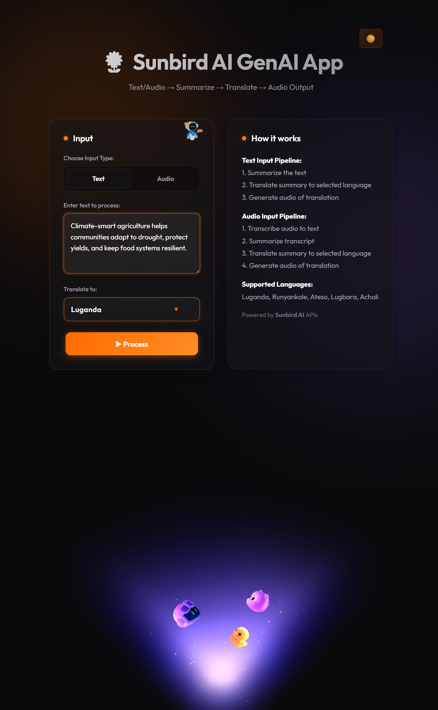
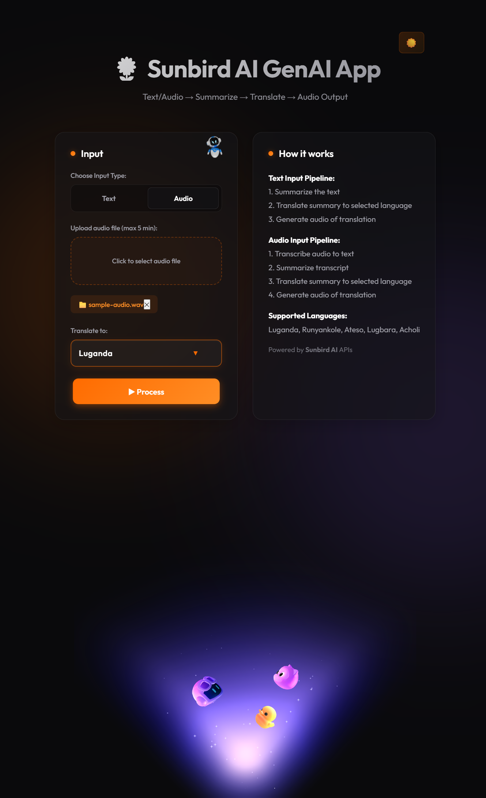
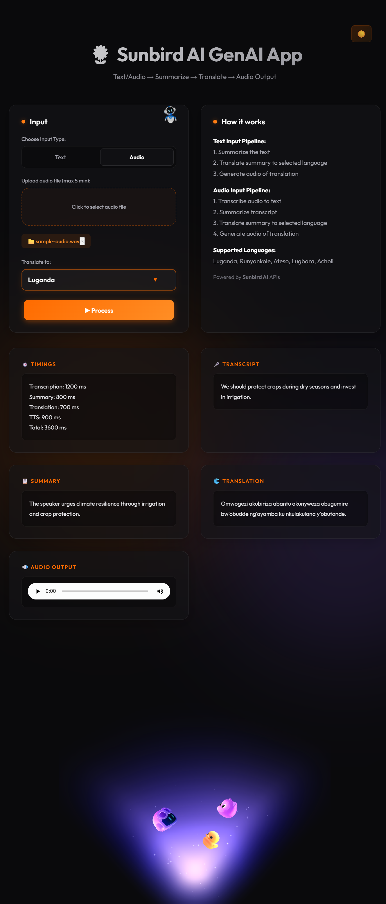

# Sunbird AI Internship Assessment

## Project Description

This project is a small Sunbird AI web application that accepts either typed text or an uploaded audio file, processes the input through transcription, summarisation, translation into a selected Ugandan language, and text-to-speech synthesis, and then shows every intermediate result in the UI.

## Deployed Link

Live app: [https://internship-assessment-steel.vercel.app/](https://internship-assessment-steel.vercel.app/)

## Architecture Overview

```text
Text input ───────────────────────────────────────────────────────┐
                                                                   ▼
Audio input → Speech-to-Text (audio only) → Summarise → Translate → Text-to-Speech → Output
```

The active web pipeline is implemented in the Next.js API routes under [app/api/process-text/route.ts](app/api/process-text/route.ts) and [app/api/process-audio/route.ts](app/api/process-audio/route.ts).

Summarisation and translation both use Sunbird AI's Sunflower Simple Inference endpoint (`/tasks/sunflower_simple`) with `model_type: "qwen"`.

## Local Setup

1. Clone the repository.

   ```bash
   git clone https://github.com/<your-username>/internship-assessment.git
   cd internship-assessment
   ```

2. Create and activate a Python virtual environment.

   ```bash
   python -m venv venv
   # Windows
   venv\Scripts\activate.bat
   # macOS/Linux
   source venv/bin/activate
   ```

3. Install dependencies.

   ```bash
   npm install
   pip install -r requirements.txt
   ```

4. Configure environment variables.

   ```bash
   cp .env.example .env.local
   ```

   Add your Sunbird token to `.env.local` before running the app.

5. Start the app.

   ```bash
   npm run dev
   ```

6. Open [http://localhost:3000](http://localhost:3000).

## Environment Variables

| Variable              | Required | Purpose                                                              |
| --------------------- | -------- | -------------------------------------------------------------------- |
| `SUNBIRD_API_TOKEN`   | Yes      | Authorises requests to Sunbird AI APIs.                              |
| `NEXT_PUBLIC_API_URL` | No       | Optional frontend API base URL override for non-default deployments. |

See [.env.example](.env.example) for the exact local development template.

## Usage

1. Choose either **Text** or **Audio** input.
2. Paste text or upload an audio file.
3. Select a target language: Luganda, Runyankole, Ateso, Lugbara, or Acholi.
4. Click **Process**.
5. Review the transcript, summary, translated summary, and generated audio player.

### Screenshots

Text input state:



Audio upload state:



Output panel:



## Known Limitations

- Audio files longer than 5 minutes are rejected in the browser before upload.
- Only the five target languages shown in the UI are supported: Luganda, Runyankole, Ateso, Lugbara, and Acholi.
- The deployed Vercel app may take a moment to wake up on the free tier, so the first request can be slower than later requests.
- Very noisy audio can reduce transcription quality, which then affects the summary, translation, and generated speech.

## Verification Notes

- Part 1 exercises are covered by [tests/test_basics.py](tests/test_basics.py).
- The Sunbird pipeline uses the Sunflower endpoint for summarisation and translation in the Next.js API routes.
